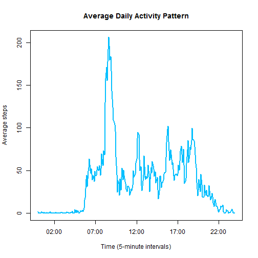

  
  
## Introduction

**Copyright 2015 Amy Richards**

This report fulfills the Peer Assessment 1 requirements for the Johns Hopkins Coursera Data Science Specialization class, Reproducible Research.

[Read the project description here.](http://github.com/amyr206/RepData_PeerAssessment1/blob/master/README.md) 
  
  
  
## Loading and preprocessing the data
The code below assumes that the repo has been forked and cloned to a local machine, and that the user's working directory has been set to the cloned directory.  
Dplyr, lubridate, stringr, and lattice libraries are used to process and present the data. If you don't already have these libraries installed, use `install.libraries("librarynamegoeshere")`.

Load the necessary libraries:

```r
library("dplyr")
library("lubridate") 
library("stringr")
library("lattice")
```

Read in the data:

```r
rawdata <- read.table(unz("activity.zip", "activity.csv"), 
                      header = TRUE, 
                      sep = ",", 
                      na.strings = "NA")
```

  
  
## What is mean total number of steps taken per day?

To explore this question, the step data is summed by day, a histogram of the daily step sums is produced, and the mean and median are calculated.


**1. A data tbl capturing the sum of steps for each day is created.**  
The assignment instructions indicate that missing data should be ignored, so NAs are filtered out.

```r
sumdailysteps <- tbl_df(rawdata) %>% 
        filter(!is.na(steps)) %>%
        group_by(date) %>%
        summarize(sumsteps = sum(steps))
```

**2. A histogram of the total daily steps is produced:**

```r
hist(x = sumdailysteps$sumsteps,
     breaks = 10,
     main = "Histogram of total daily steps",
     xlab = "Total daily steps",
     col = "deepskyblue")   
```

 

**3. The mean and median are calculated:**

```r
mean(sumdailysteps$sumsteps)
```

```
## [1] 10766.19
```

```r
median(sumdailysteps$sumsteps)
```

```
## [1] 10765
```
  
  
  
## What is the average daily activity pattern?

To answer this question, steps are averaged by 5-minute intervals across days, and a time series of the intervals is plotted. The interval in which the maximum average number of steps were taken across days is discovered.

**A data tbl capturing the average of steps for each interval across days is created:**  
NAs are filtered out.  
The intervals required some additional processing so they'd be accurately represented in the plot. If the data was left as found and grouped on the interval column, R would perceive an incorrect gap between 55 and 100 - it would interpret the difference between those intervals as 45 instead of 5. Converting the intervals to a POSIXct date/time class didn't quite work either - a way to group on only the hour/minute interval across days without changing the class wasn't obvious. To accurately represent the intervals as times (instead of integers), and to allow averaging steps during intervals across different days, a column is added in which the date of all the entries is set to today and the hours/minutes are set based on the intervals.  

```r
avgsteps <- tbl_df(rawdata) %>%
        filter(!is.na(steps)) %>%        
        mutate(intervalstoplot = ymd_hms(paste(today(), str_pad(interval, 4, pad = 0), "00"))) %>% 
        group_by(intervalstoplot, interval) %>%
        summarize(meansteps = mean(steps))
```

**1. A time series plot of the average steps for each interval is created:**

```r
        plot(x = avgsteps$intervalstoplot, y = avgsteps$meansteps,
        type = "l",
        main = "Average Daily Activity Pattern",
        xlab = "Time (5-minute intervals)",
        ylab = "Average steps",
        lwd = 2,
        col = "deepskyblue")
```

 

**2. The 5-minute interval with the maximum average steps is determined:**

```r
avgsteps[which.max(avgsteps$meansteps), 2:3]
```

```
## Source: local data frame [1 x 2]
## 
##   interval meansteps
## 1      835  206.1698
```
The interval with the maximum number of average steps starts at 8:35am.
  
   
## Imputing missing values

In this section, the number of missing step measurements is identified, a strategy for filling them in is determined, a dataset with the imputed values is created, the analysis from the *What is mean total number of steps taken per day?* section is recreated with the imputed values, and results compared.

**1. The number of missing values in the original data is found:**

```r
count(rawdata, is.na(steps))
```

```
## Source: local data frame [2 x 2]
## 
##   is.na(steps)     n
## 1        FALSE 15264
## 2         TRUE  2304
```
  
There are 2304 intervals missing a step count.  

**2. The imputation strategy is explained:**  
This investigator is without any statistics experience and not yet an R genius, so many strategies were explored and discarded. For instance, [a thread on Stack Overflow](http://stackoverflow.com/questions/22693173/imputing-missing-values-linearly-in-r) had me way excited about `approxfun()`. Alas, I couldn't get it to work. Therefore, one of the strategies suggested in the instructions is used - missing step values are filled in with the interval's mean steps across all days, as determined in the *What is the average daily activity pattern?* section.

**3. A new dataset with imputed values in place of the missing ones is created:**  
Records for which a step count is missing are filled in with the average step count for the interval, merged with the complete cases, and grouped and summed as before.

```r
# Filter for NAs and impute the missing values
dailystepsimputed <- tbl_df(rawdata) %>% 
        filter(is.na(steps)) %>%
        left_join(avgsteps, by = "interval") %>%
        select(date, interval, meansteps) %>%
        rename("steps" = meansteps)

# Filter for complete cases
dailystepscompletecases <- tbl_df(rawdata) %>%
        filter(!is.na(steps))

# Merge the imputed and complete data and group/sum
sumalldailysteps <- dailystepsimputed %>%
        bind_rows(dailystepscompletecases) %>%
        group_by(date) %>%
        summarize(sumsteps = sum(steps))
```

**4. A histogram of total daily steps is plotted, the mean and median are calculated, and results are compared with the earlier analysis to see if imputation made a difference.**

```r
hist(x = sumalldailysteps$sumsteps,
     breaks = 10,
     main = "Histogram of total daily steps (NAs imputed)",
     xlab = "Total daily steps",
     col = "deepskyblue4")   
```

 
  

```r
mean(sumalldailysteps$sumsteps)
```

```
## [1] 10766.19
```

```r
median(sumalldailysteps$sumsteps)
```

```
## [1] 10766.19
```
  
Unsurprisingly, filling in averages for missing data kept the mean the same and pushed the median up slightly to equal the mean. The frequency of intervals that fall into the middle bin in the histogram increased.


## Are there differences in activity patterns between weekdays and weekends?

To address this question, a weekday/weekend factor is added to the data (including imputed and complete cases) and a trellis line plot is generated for comparison.  

**1. Create the weekday/weekend factor**  
The imputed and complete cases are combined, and the weekday/weekend factor is added (I used lubridate's wday() function instead of the weekdays() function because a former classmate mentioned it might work better for computers not using English as the default language. Then, the intervals are processed as they were in the *What is the average daily activity pattern?* section above.  

```r
avgalldailysteps <- dailystepsimputed %>%
        bind_rows(dailystepscompletecases) %>%
        mutate(daytype = ifelse(wday(date) >= 2 & wday(date) <= 6, "weekday", "weekend")) %>%
        mutate(intervalstoplot = ymd_hms(paste(today(), str_pad(interval, 4, pad = 0), "00"))) %>% 
        group_by(intervalstoplot, daytype) %>%
        summarize(avgsteps = mean(steps))
```

**2. A panel of time series plots of the average steps for each interval on weekdays and weekends is created:**  

```r
trellis.par.set(plot.linecol = "deepskyblue4")
xyplot(avgsteps ~ intervalstoplot | daytype,
       data = avgalldailysteps,
       type = "l",
       layout = c(1,2),
       main = "Weekend and weekday activity levels",
       xlab = "Time (5-minute intervals)",
       ylab = "Average steps",
       ylim = c(-1, 250),
       scales = list(relation = "free", 
                     format = "%H:%M"
                     ))
```

 
  
There are differences between weekend and weekday activity levels. While the most average steps are taken during weekday mornings, activity levels in general are higher throughout the day on the weekends.
